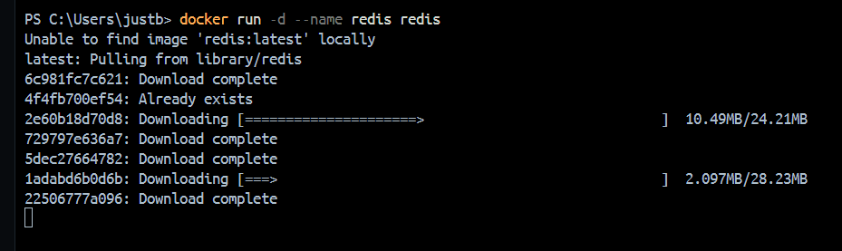
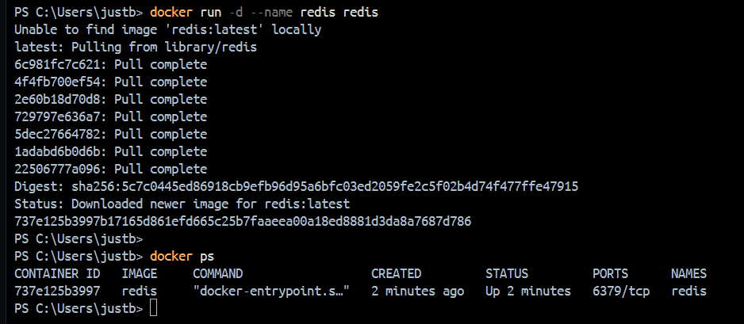
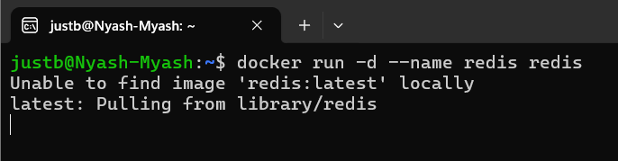
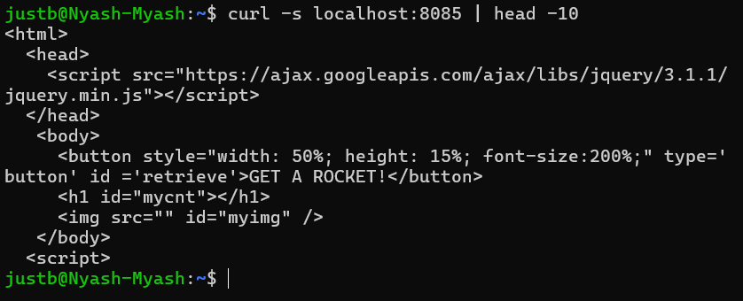
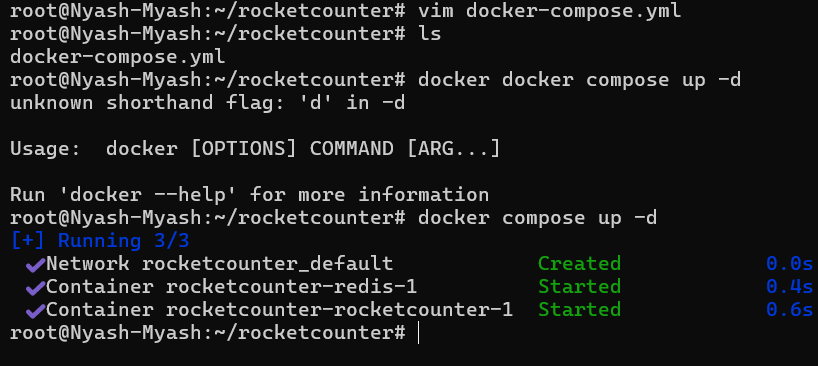
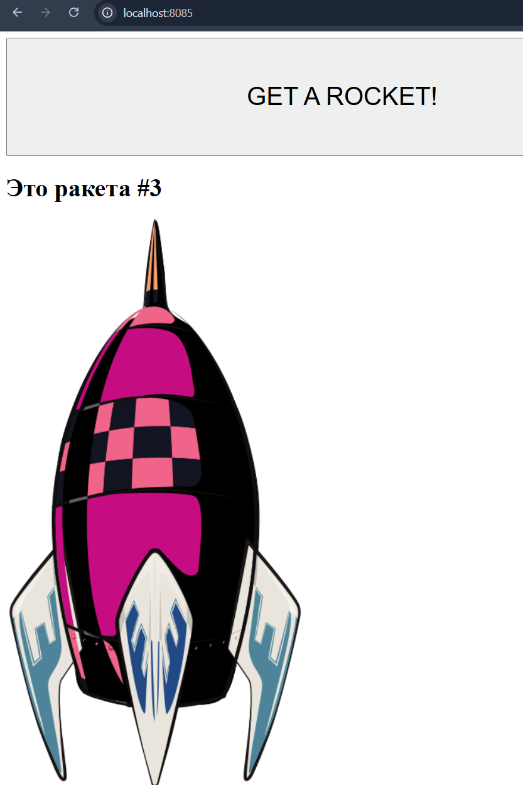
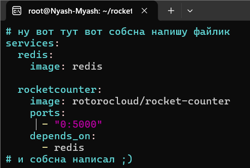
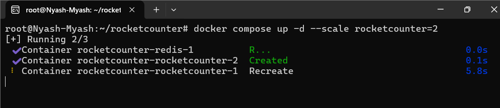

# Запуск вручную

# Вступление
В процессе работы перешёл в WSL, чтобы использовать команды, как было показано в лекциях
---

# Часть 1. Запуск вручную (контейнеры docker run)

запускаем "в лоб"



Проверяем




Проверяем


Очищаем


```
Далее я перенёс всё, что было ранее в WSL, по описанной в начале причине.
```



Теперь можно выполнить команду
```BASH
curl -s localhost:8085 | head -10
```

---

Удаляем конетйнеры


# Часть 2. Описание стека в docker-compose.yml

Создал каталог /root/rocketcounter и перешёл в него.







# Часть 3. Масштабирование приложения

Редактируем `docker-compose.yml`



Масштабируем



Тестируем


# Часть 4. Полное уничтожение стека

