# Задание 1. Исследование сетей Docker на хосте

## 1.1 Определить, какие сети созданы в Docker по умолчанию на вашей машине.
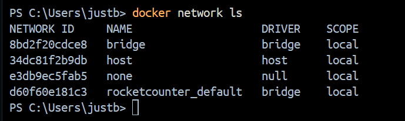
## 1.2 Для сети по умолчанию типа bridge:
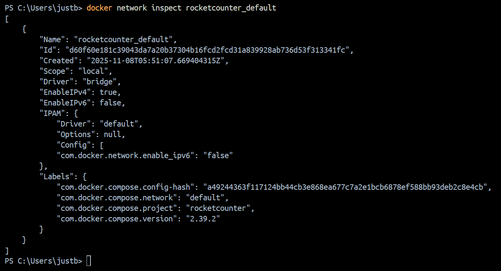
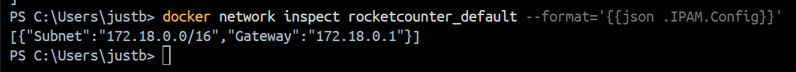
- определить ее подсеть (диапазон адресов) и адрес шлюза

    подсеть: `172.18.0.0/16 `

    адрес шлюза: `172.18.0.1`
- кратко описать, для чего используется эта сеть

    ОТВЕТ: ДА!
## 1.3 Кратко описать назначение трех стандартных сетей:
- bridge:

    Стандартный тип сети Docker. Каждому контейнеру назначается внутренний IP-адрес, они могут взаимодействовать друг с другом внутри этой сети

- host:

    Контейнер работает в сетевом пространстве хоста, используя его IP-адреса и сетевые интерфейсы напрямую. Между контейнером и хостом отсутствует сетевая изоляция.

- none:

    Контейнер создаётся без подключения к каким-либо сетевым интерфейсам, кроме loopback. Это обеспечивает максимальную сетевую изоляцию и используется, когда контейнеру не нужен сетевой доступ или сеть настраивается вручную.

# Задание 2. Публикация порта контейнера
## 2.1 брать любой простой веб-сервис в контейнере
У меня это будет версия моего задания по практике taskManager 
## 2.2 Запустить контейнер так, чтобы:
- внутри контейнера приложение слушало внутренний порт (например, 80 или 8000)
- на хосте этот сервис был доступен по другому порту (например, 8080)
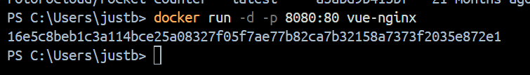
## 2.3 Проверить, что веб-сервис доступен:
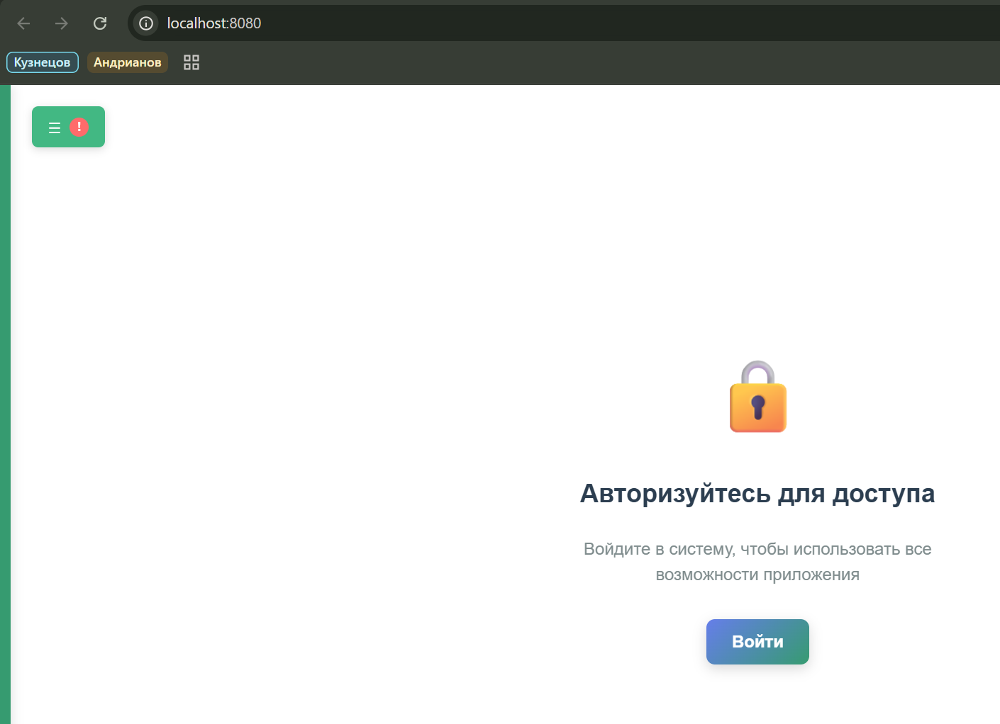

# Задание 3. Пользовательская bridge-сеть и взаимодействие по имени
## 3.1 Создать пользовательскую мостовую сеть (bridge):
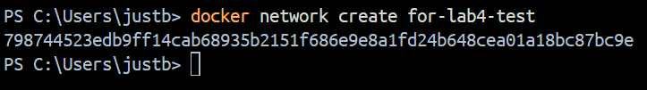
## 3.2 Поднять в этой сети два контейнера:
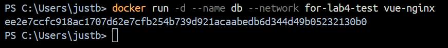
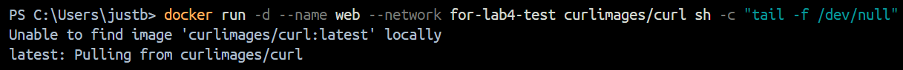
## 3.3 Настроить взаимодействие:
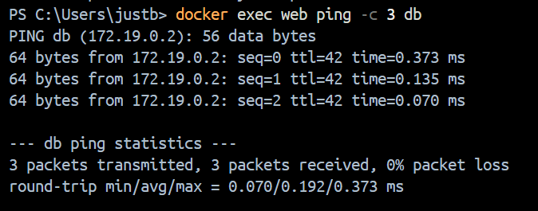
## 3.4 Убедиться, что имя контейнера действительно используется как адрес, а не «случайный IP»:
Пересоздал контейнер так, чтобы у него был другой ip, но тоже имя и видно, что при обращении по имени пингуется уже другой ip
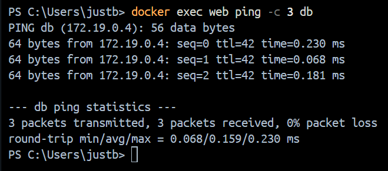

# Задание 4. Изоляция контейнера
## 4.1 Запустить третий контейнер, который не подключен к созданной пользовательской сети
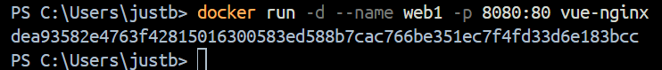
## 4.2 Попробовать из этого контейнера обратиться к сервису db
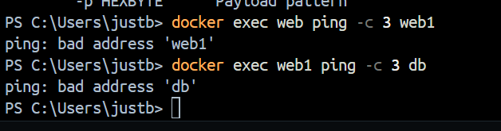
## 4.3 Наблюдать, что доступ невозможен (ошибка разрешения имени/подключения).
Наблюдаю...