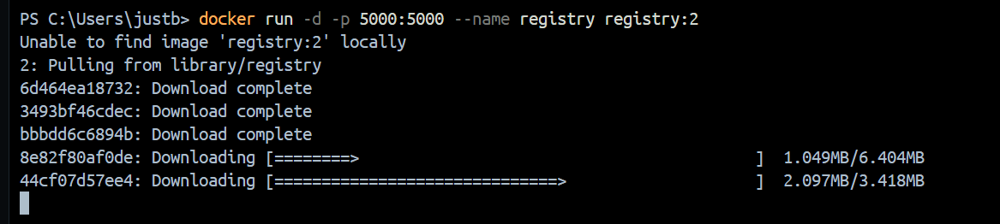
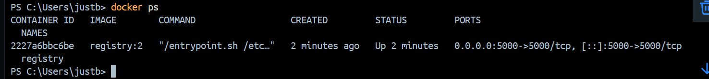
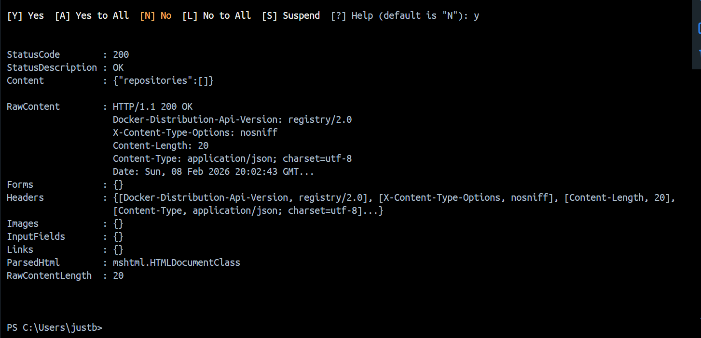
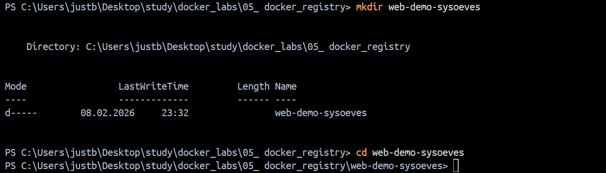
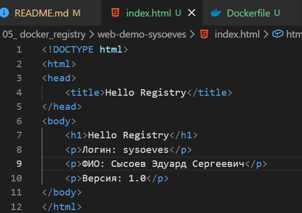
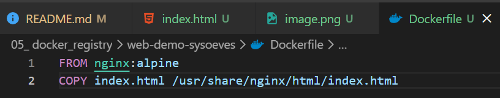
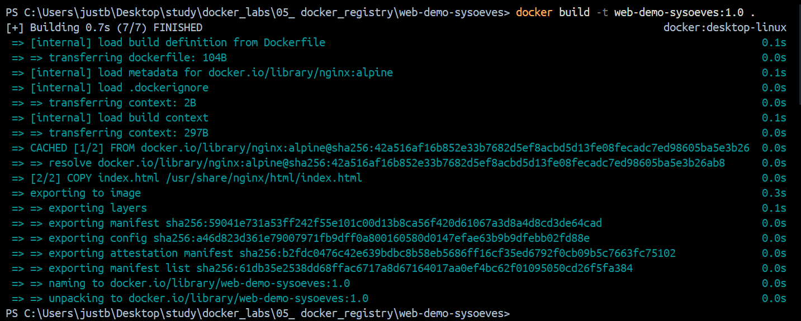
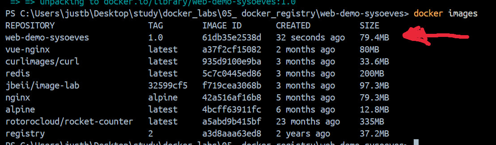
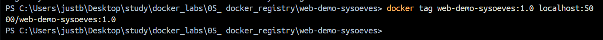
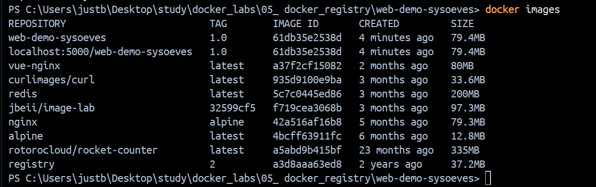

# 1 Поднимите локальный registry

Поднимаем контейнер:

Проверяем:

# 2 Проверка registry по API

# 3 Подготовьте мини-проект

index.html:

deckerfile:

# 4 Сборка образа
запускаем:

Проверка:

# 5 Привязка образа к registry через tag

проверка:

# 6 Push в registry
# 7 Проверка, что образ реально в registry
# 8 Проверка pull
# 9 Проверка запуском контейнера
# 10 Самостоятельная часть
## 10.1 Версия 2.0
## 10.2 Второй запуск на другом порту