# 1 Поднимите локальный registry

Поднимаем контейнер:

Проверяем:

# 2 Проверка registry по API

# 3 Подготовьте мини-проект

index.html:

deckerfile:

# 4 Сборка образа
запускаем:

Проверка:

# 5 Привязка образа к registry через tag

проверка:

# 6 Push в registry
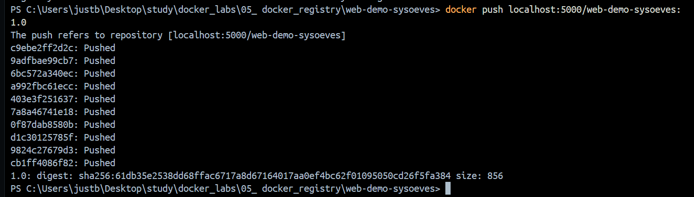

# 7 Проверка, что образ реально в registry
Проверьте список репозиториев: curl `http://localhost:5000/v2/_catalog`

Ожидаемо: {"repositories":["web-demo-<ваш_логин>"]}
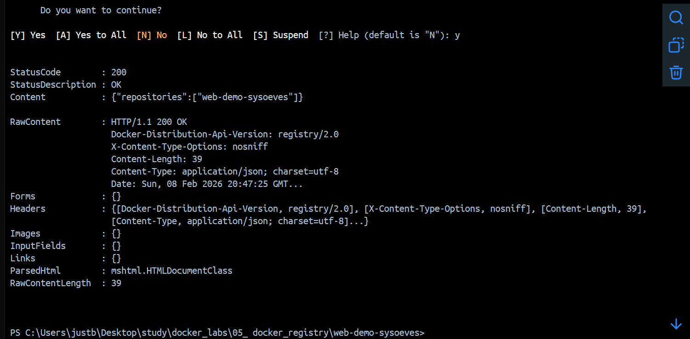

Проверьте список тегов: curl `http://localhost:5000/v2/web-demo-username/tags/list`

Ожидаемо: {"name":"web-demo-<ваш_логин>","tags":["1.0"]}
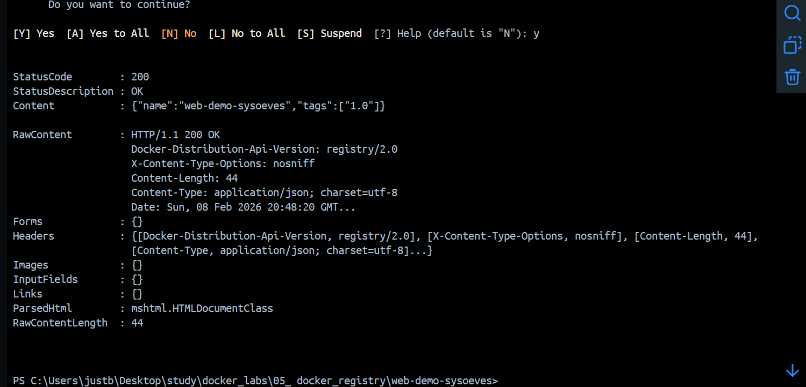

# 8 Проверка pull
Удаляю тег:
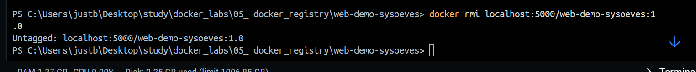

Пулю:
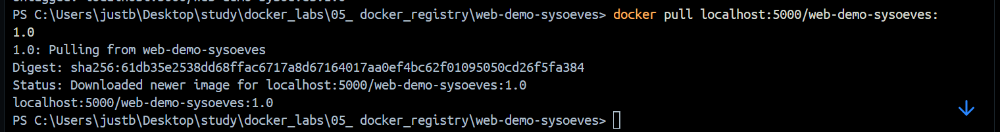

# 9 Проверка запуском контейнера
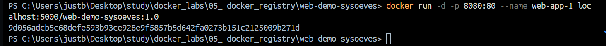

курлык:

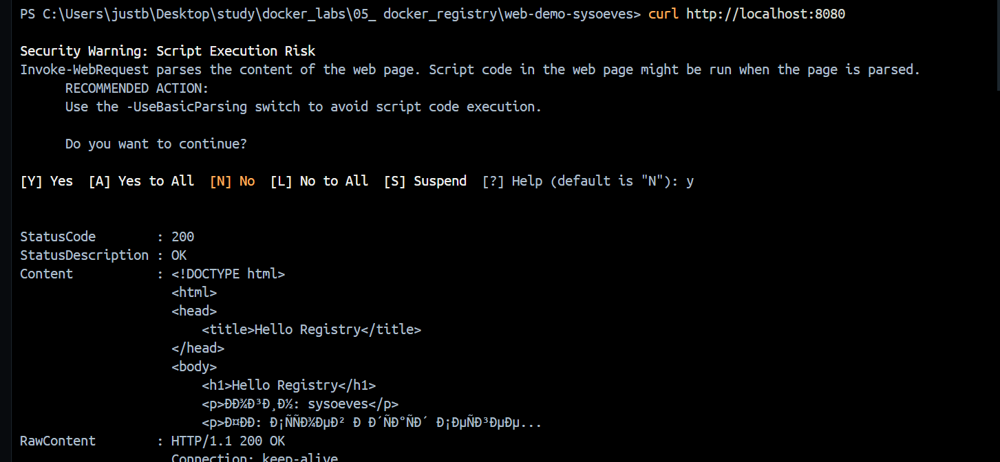
сайт:
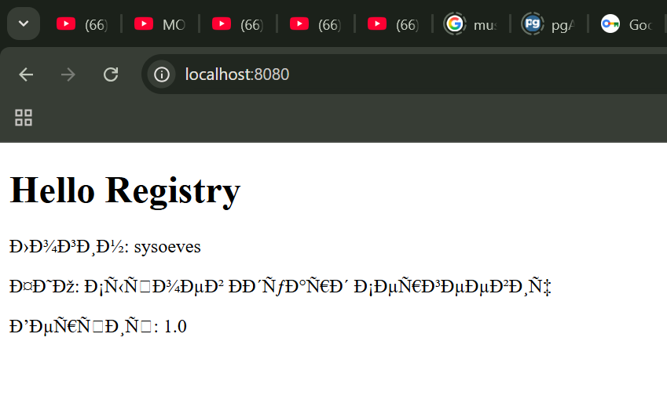

# 10 Самостоятельная часть
## 10.1 Версия 2.0
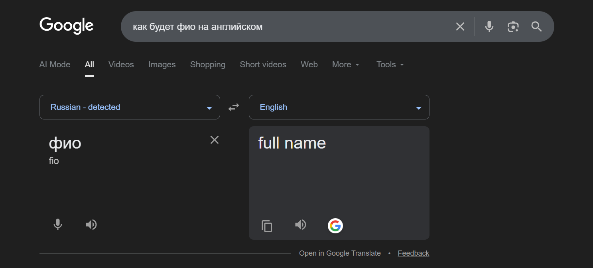

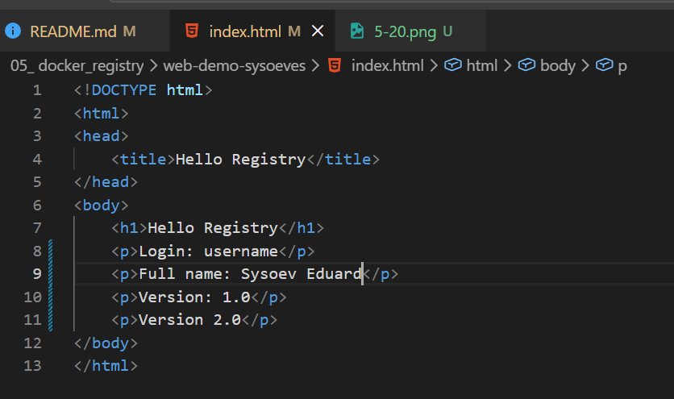

Пересобрал:
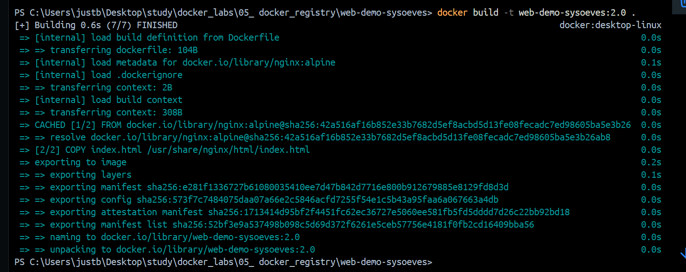

Привязка к registry:
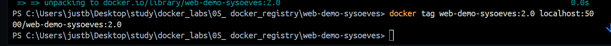

Push:
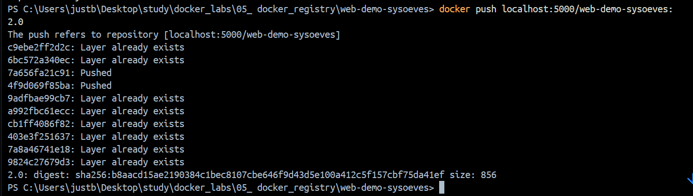

проверка тега. Ожидаемый результат: `{"name":"web-demo-username","tags":["1.0","2.0"]}`
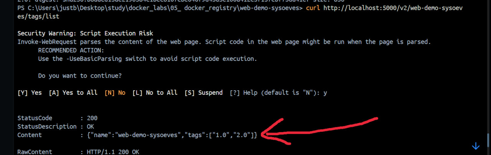

## 10.2 Второй запуск на другом порту