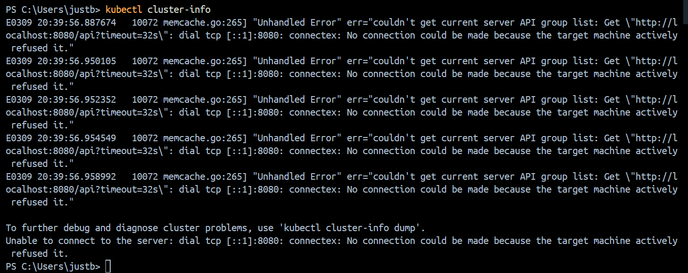
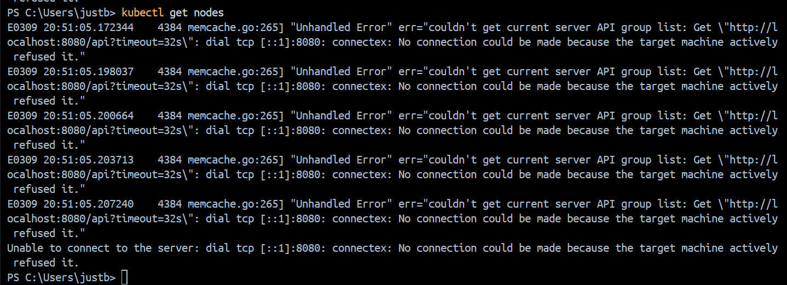

# Часть 1. Проверка доступа к кластеру и namespace
## Задание 1. Проверка кластера
### 1.1.1 Получите информацию о кластере (скрин).

### 1.1.2 Выведите список нод (скрин).

## 1.1.3 Контрольные вопросы (в отчет):
* Чем отличаются node и cluster?
    > `Node` — отдельная физическая или виртуальная единица, а `cluster` — совокупность из nodes.
* Где логически находится control plane, а где worker (если визуально не видно)?
    > да
## Задание 2. Namespace
### Создайте namespace lab-k8s-username.
### Убедитесь, что namespace создан.
### Далее выполняйте все действия в этом namespace: либо параметром -n, либо настройкой контекста (способ выберите сами).
## Контрольные вопросы:

* Зачем нужен namespace?
> 
* Что будет, если работать в default?
> 