# Часть 1. Проверка доступа к кластеру и namespace
## Задание 1. Проверка кластера
### 1.1.1 Получите информацию о кластере (скрин).

### 1.1.2 Выведите список нод (скрин).

## 1.1.3 Контрольные вопросы (в отчет):
* Чем отличаются node и cluster?
    > `Node` — отдельная физическая или виртуальная единица, а `cluster` — совокупность из nodes.
* Где логически находится control plane, а где worker (если визуально не видно)?
    > ДА

## Задание 2. Namespace
### Создайте namespace lab-k8s-username.

### Убедитесь, что namespace создан.

### Далее выполняйте все действия в этом namespace: либо параметром -n, либо настройкой контекста (способ выберите сами).

## Контрольные вопросы:

* Зачем нужен namespace?
    >  ДА
* Что будет, если работать в default?
    > ДА

# Часть 2. Deployment и реплики (через YAML)
## Задание 3. Создание Deployment web

## Контрольные вопросы:
 
* Чем отличаются Deployment, ReplicaSet и Pod?
    > ДА
* Где хранится «желаемое состояние» и кто его поддерживает?
    > ДА

# Часть 3. Масштабирование и наблюдение
## Задание 4. Масштабирование
### Увеличьте количество реплик web до 5. Уменьшите до 2.

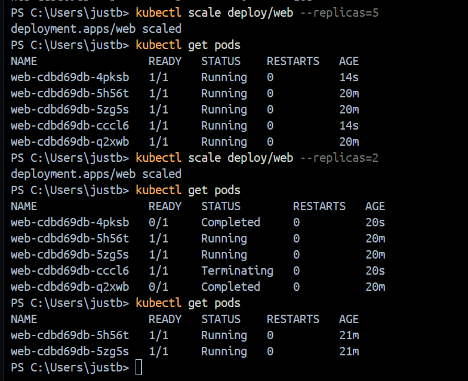

* Почему Kubernetes может удалить любой pod при scale down?
    > ДА
* Что такое readiness/liveness и как это влияет на доступность?
    > ДА

# Часть 4. Service и доступность
## Задание 5. Публикация Service

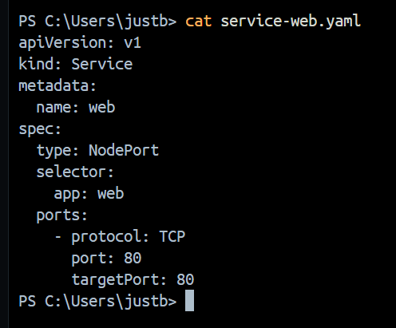

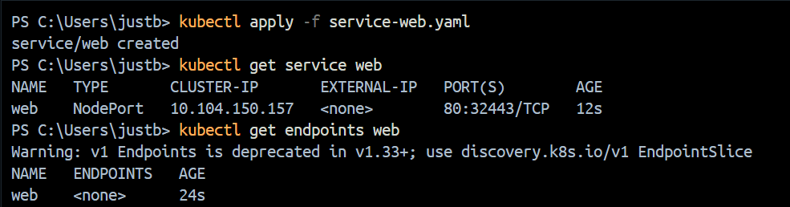

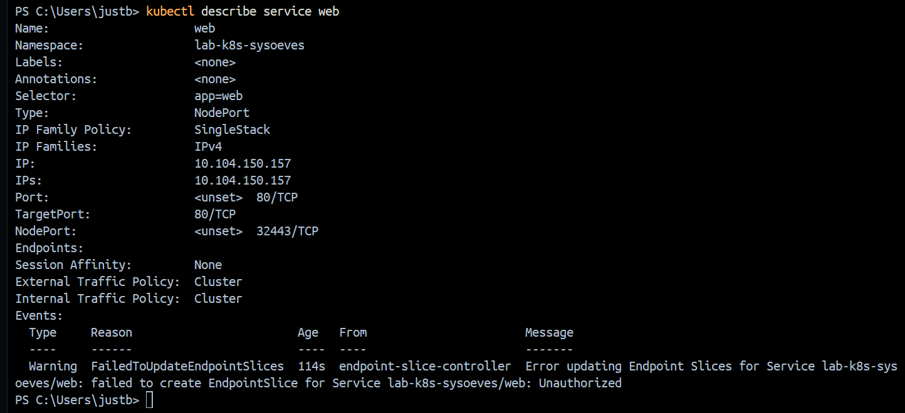

## Контрольные вопросы:
* Почему Service дает «стабильную точку входа», даже если pod’ы пересоздаются?
    > ДА
* Чем отличается ClusterIP от NodePort?
    > ДА

# Часть 5. Rolling update и rollback
## Задание 6. Обновление версии (rolling update)

Обновите образ в Deployment web на другую версию nginx.

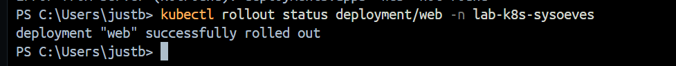

Требования:
* новая версия должна отличаться от старой (тег другой);
* обновление должно пройти как rollout.
* В отчете зафиксируйте:
    * какая версия была (1.26);
    * на какую версию обновили;
    * чем подтвердили успешное завершение rollout;
    * историю ревизий Deployment.

## Контрольные вопросы:
* Что именно обновляется при rollout: pod’ы или что-то еще (ReplicaSet/Deployment)?
    >
* Зачем Kubernetes хранит историю ревизий?
    >

## Задание 7. Откат (rollback)
### Откатите Deployment web на предыдущую ревизию.

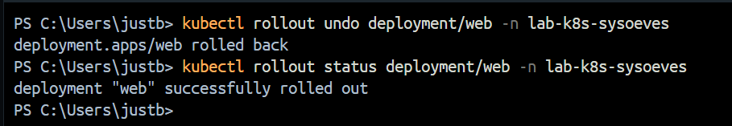

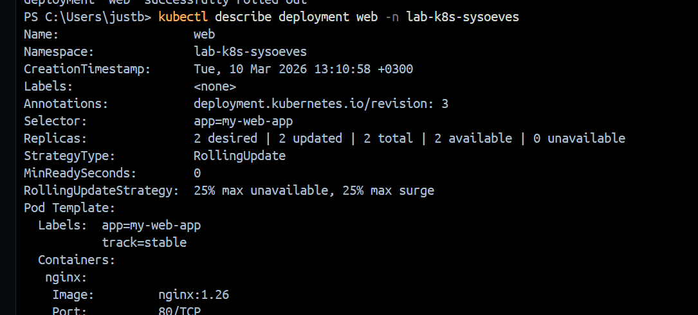

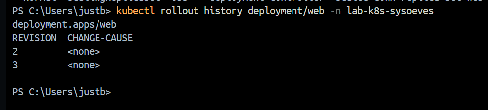

* В отчете зафиксируйте:
    * как вы определили предыдущую ревизию;
    * докажите, что версия вернулась (история/описание/текущий image).

## Контрольные вопросы:
* Что считается предыдущей ревизией?
    >
* В каких случаях rollback критически важен в продакшене?
    >

# Часть 6. Canary / A–B через две версии и разные реплики
## Задание 8. Проектирование labels

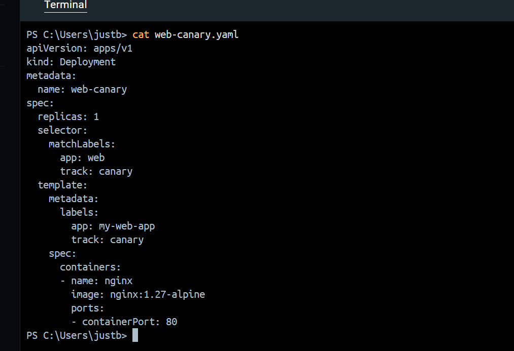

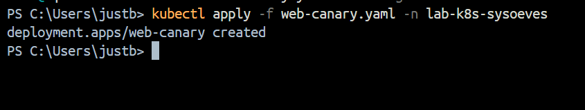

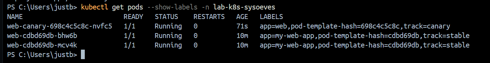

## Задание 9. Создание web-canary

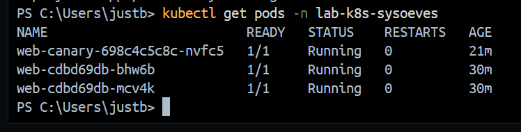

## Задание 10. Проверка A–B поведения
Сделайте 15–20 запросов к Service (способ выберите сами) и подтвердите распределение трафика.

### На подумать: как отличить ответы stable от canary, если nginx “по умолчанию одинаковый”? Выберите один вариант и обоснуйте:
1) разные образы, которые возвращают разный текст (например, http-echo с разными сообщениями);
2) простая кастомизация nginx (разный index.html через ConfigMap/volume – если тема проходилась);
3) фиксация попадания запросов на разные pod’ы (exec/логи) с объяснением.

## Контрольные вопросы:
* Почему трафик распределяется примерно пропорционально количеству pod’ов?
    > ДА
* Чем labels отличаются от annotations?
    > ДА

# Часть 7. Диагностика
# Задание 11. Ошибка selector (искусственно)

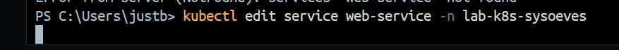

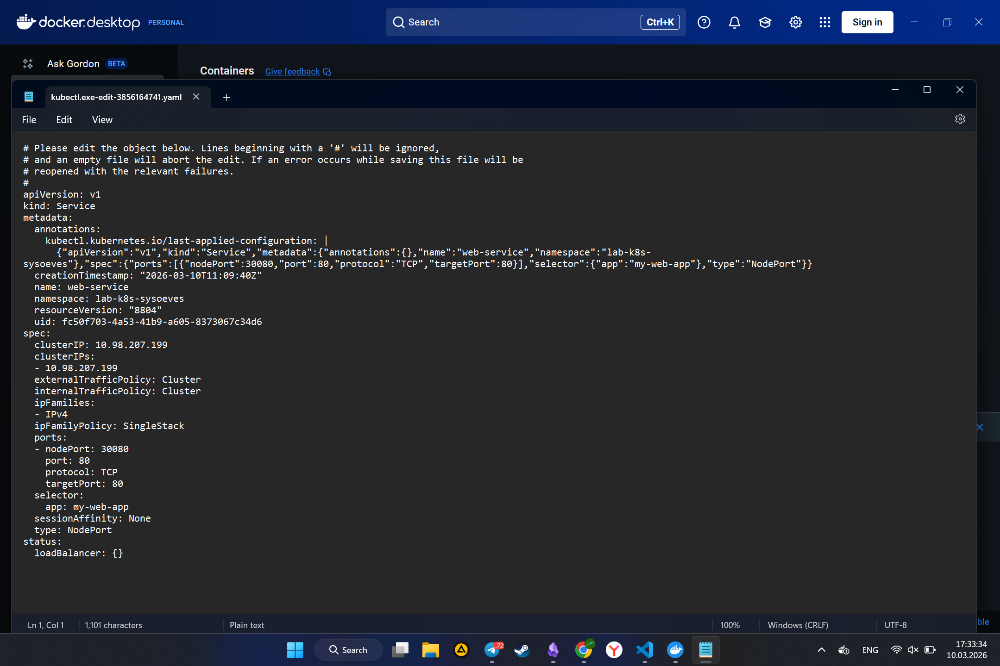

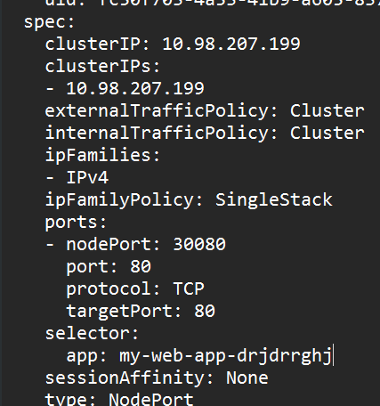

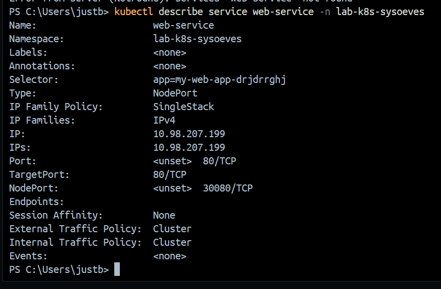

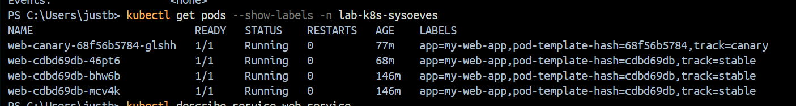

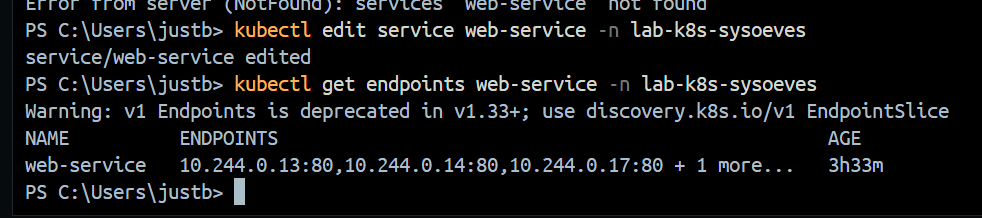

## Контрольные вопросы:
* Почему «Service есть», но приложение недоступно?
    > ДА
* Какой самый быстрый способ понять, что selector не совпал?
    > ДА