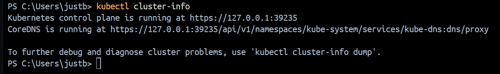
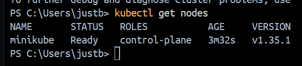
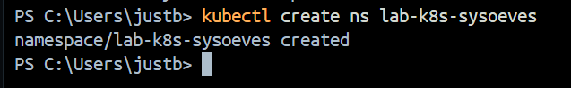
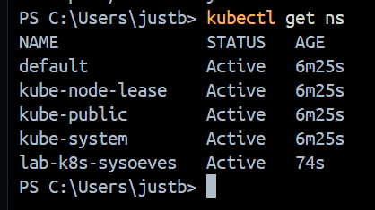
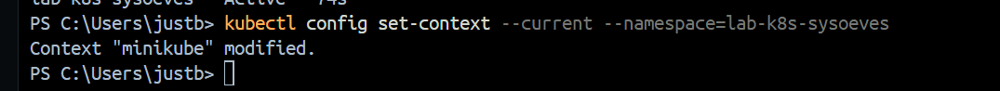
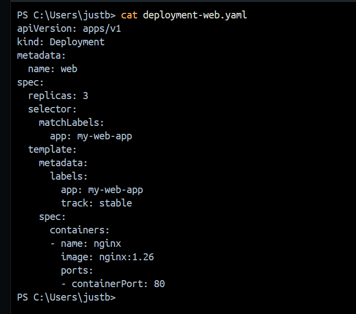
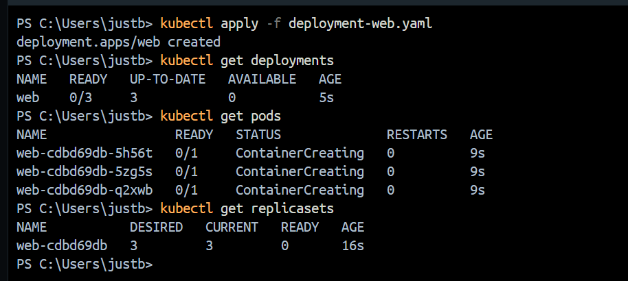

# Часть 1. Проверка доступа к кластеру и namespace
## Задание 1. Проверка кластера
### 1.1.1 Получите информацию о кластере (скрин).

### 1.1.2 Выведите список нод (скрин).

## 1.1.3 Контрольные вопросы (в отчет):
* Чем отличаются node и cluster?
    > `Node` — отдельная физическая или виртуальная единица, а `cluster` — совокупность из nodes.
* Где логически находится control plane, а где worker (если визуально не видно)?
    > да

## Задание 2. Namespace
### Создайте namespace lab-k8s-username.

### Убедитесь, что namespace создан.

### Далее выполняйте все действия в этом namespace: либо параметром -n, либо настройкой контекста (способ выберите сами).

## Контрольные вопросы:

* Зачем нужен namespace?
    >  
* Что будет, если работать в default?
    > 

# Часть 2. Deployment и реплики (через YAML)
## Задание 3. Создание Deployment web

## Контрольные вопросы:
 
* Чем отличаются Deployment, ReplicaSet и Pod?
    >
* Где хранится «желаемое состояние» и кто его поддерживает?
    >