# Преподготовка

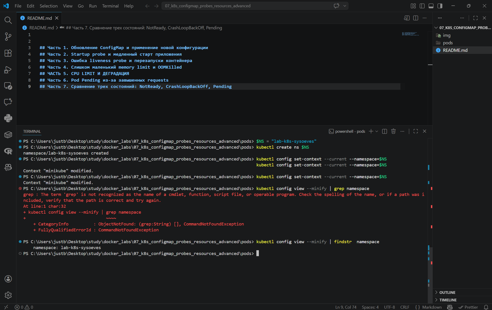

[base.yaml](pods/base.yaml)

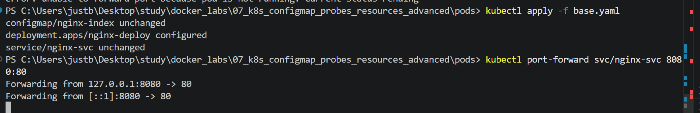

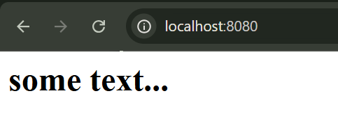

# Часть 1. Обновление ConfigMap и применение новой конфигурации

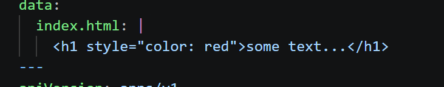

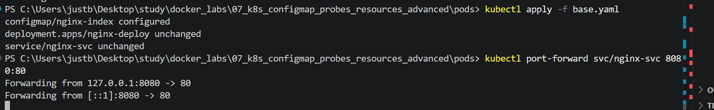

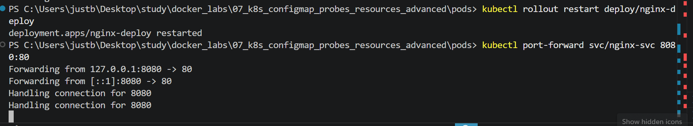

# Часть 2. Startup probe и медленный старт приложения

[slow-start.yaml](pods/slow-start.yaml)

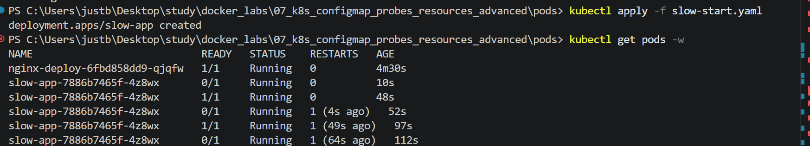

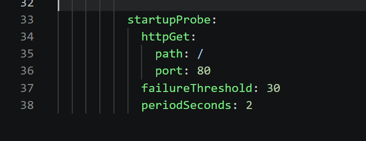

# Часть 3. Ошибка liveness probe и перезапуски контейнера

[liveness-probe.yaml](pods/liveness-probe.yaml)

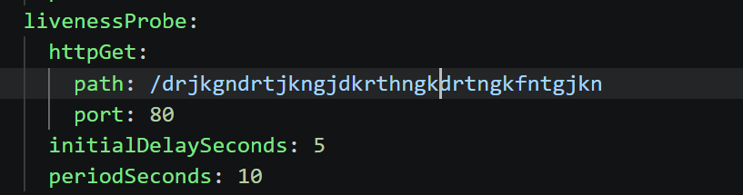

# Часть 4. Слишком маленький memory limit и OOMKilled

[oom.yaml](pods/oom.yaml)

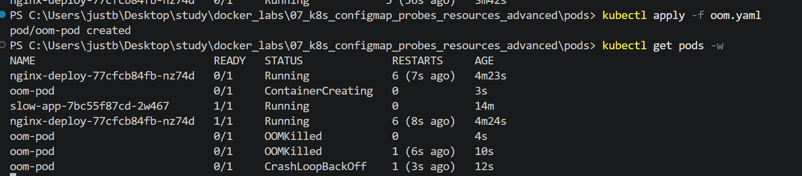

# ЧАСТЬ 5. CPU LIMIT И ДЕГРАДАЦИЯ

[cpu.yaml](pods/cpu.yaml)

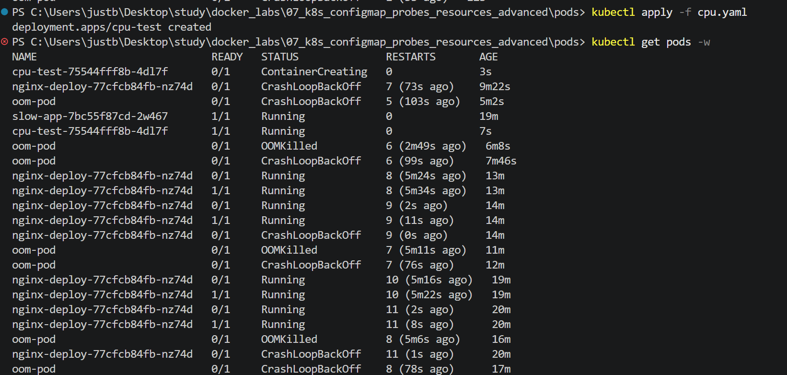

# Часть 6. Pod Pending из-за завышенных requests

[pending.yaml](pods/pending.yaml)

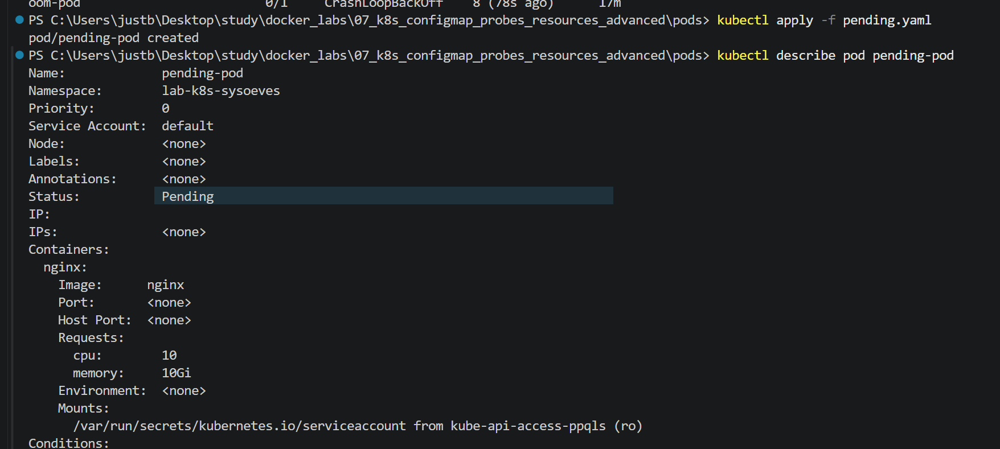

# Часть 7. Сравнение трех состояний: NotReady, CrashLoopBackOff, Pending

| Состояние        | Когда возникает                           | Основной симптом          | Где смотреть причину |
| ---------------- | ----------------------------------------- | ------------------------- | -------------------- |
| NotReady         | Приложение не отвечает, probe не проходит | Pod Running, но 0/1 READY | describe pod, events |
| CrashLoopBackOff | Падает контейнер, liveness убивает        | Постоянные рестарты       | describe pod, logs   |
| Pending          | Не хватает ресурсов на ноде               | Pod не стартует           | describe pod, events |
